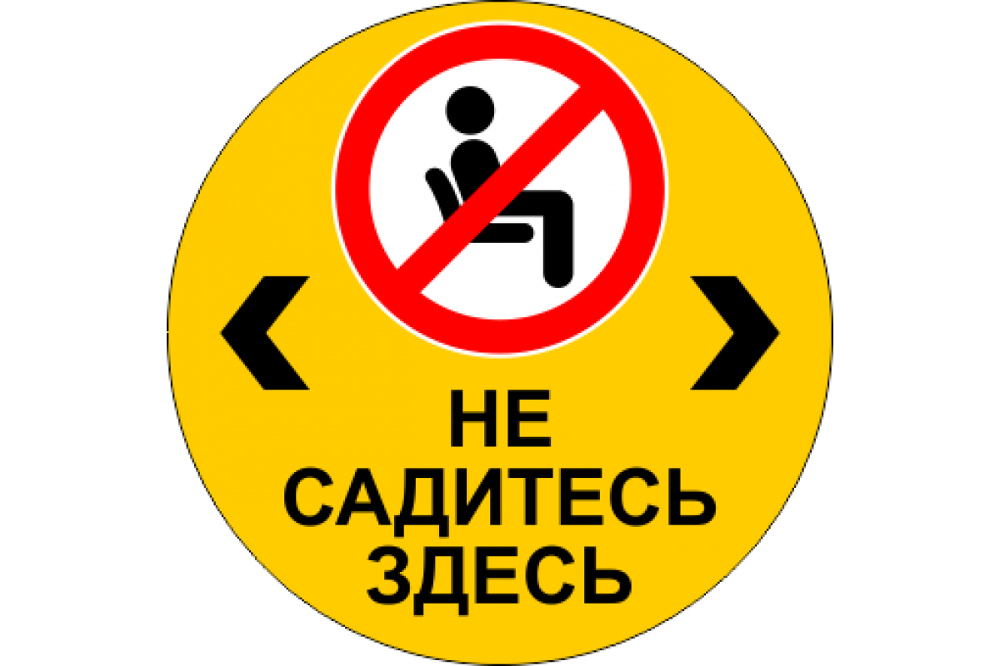

<html lang="ru">
<head>
    <meta charset="UTF-8">
    <title>Страница с картинкой</title>
</head>
<body>
    <!-- Заголовок -->
    <h1>Моя первая страница с картинкой</h1>
    
    <!-- Изображение -->
    
    
    <!-- Подпись к изображению -->
    
Это моя любимая картинка!

</body>
</html>
